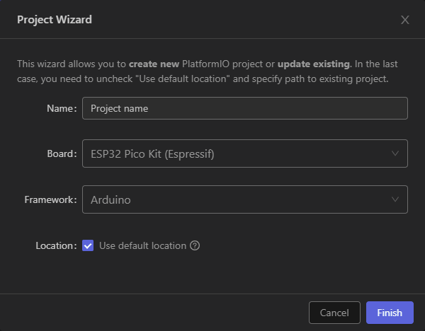

# [LilyGO](http://lilygo.cn/) TTGO Boards and Devices

## Weekend Projects: _Truck Simulator Dashboard on VGA Screen_

I'm really enjoying the [American Truck Simulator](https://americantrucksimulator.com/) Convoy beta. This is the first time there has been official online multiplayer in ATS, and having friends on the road with me has been making those long journeys and difficult hauls a lot more bearable!

I'm playing the game with an old ThinkPad laptop docked to dual screens. I'd love to have a panoramic view of my Western Star's cabin, but there's no way the old Intel integrated graphics can push that many pixels at a playable framerate. Adding a graphics card would help, but as of summer 2021 used prices are high, and new budget cards are still unavailable. But that got me to thinking; is there something different I could do with my idle second monitor that could be conducive to my trucking success?

I remember tinkering with [SCS's excellent SDK tools](https://modding.scssoft.com/wiki/Documentation/Engine/SDK/Telemetry) and using them to display information on a web server a few years ago. This time, I'm going to send the information to a [TTGO VGA 32](../vga32.md) and have it draw to the screen using the [FabGL graphics library](https://github.com/fdivitto/fabgl).

### Setting up our environment

We will be using Visual Studio Code and PlatformIO for this project. I recommend the [documentation](https://docs.platformio.org/en/latest/integration/ide/vscode.html#ide-vscode) to help you get it installed if you've never used it before. With PlatformIO we can make use of the extensive software libraries and board support of Arduino, with the powerful capabilities and functions of the VSCode IDE.

First, we need to install the boards and the libraries. This is a similar process to the Arduino IDE, we just need to look in a different place.

1. Start a new PlatformIO project by clicking the PlatformIO icon on the left sidebar (an alien's head).
2. Expand PIO Home, then click Platforms.
3. Search for Espressif 32, and click Install.
4. Under PIO Home, click Libraries.
5. Search for FabGL. Click install on FabGL by Fabrizio Di Vittorio.

Now our boards and libraries are installed, it's time to create a PlatformIO project:

1. Open PlatformIO Quick Access if it isn't already by clicking the PIO logo on the left sidebar.
2. Under PIO Home, click open.
3. On the PIO Home page, click New Project. 
4. Name your project (I'm calling mine truckDash32), select the ESP32 Pico Kit as the board, and choose Arduino for the framework.
5. Click Finish, and PlatformIO will set up our project.

