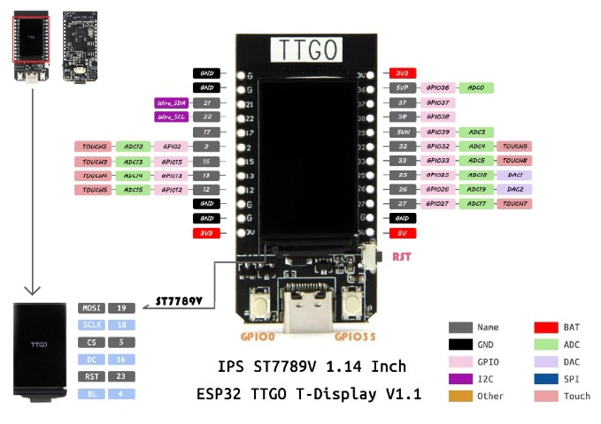

# [LilyGO](http://lilygo.cn/) TTGO Boards and Devices

 [ebay/praisedpern](https://www.ebay.co.uk/usr/praisedpern/) - [github/praisedpern](https://www.github.com/praisedpern/)

## TTGO T-Display

[T-Display](t-display-phone.jpg)

### Pin Diagram

### Setting up Arduino IDE

1. Download and install the Arduino IDE from [https://www.arduino.cc/en/software](https://www.arduino.cc/en/software), or from your system's package manager.

2. Download the additional libraries from [https://github.com/Xinyuan-LilyGO/TTGO-T-Display](https://github.com/Xinyuan-LilyGO/TTGO-T-Display), and copy the folder named TFT_eSPI into your ~\Documents\Arduino\libraries\ folder (on Linux this may be ~/Arduino/libraries).

3. Open Arduino and select Tools > Board: > Boards Manager...

4. From Boards Manager, search for esp32 and click Install.

5. Once it is installed, close Boards Manager then select Tools > Board: > ESP32
   Arduino > TTGO Lora32-OLED V1.

6. Plug the board into your PC with a USB cable and wait for any drivers to install. Go to Tools > Port: and select the COM port for your T-Display. If Arduino IDE can't find the port for your board, you may need to download and install the UART driver from [https://www.silabs.com/developers/usb-to-uart-bridge-vcp-drivers](https://www.silabs.com/developers/usb-to-uart-bridge-vcp-drivers).
